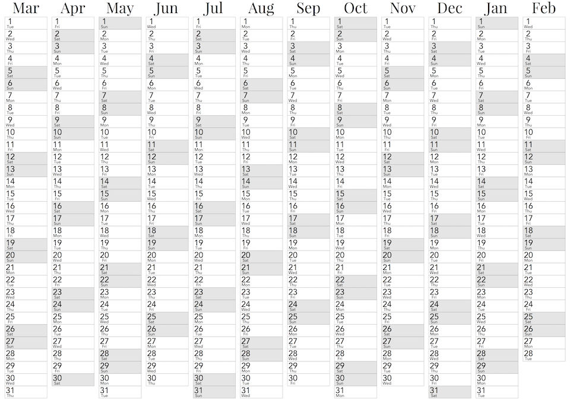

# [Webconfigurator](http://Calendar.MapOfTea.com/)

# papr

Command line tool to generate a PDF template for a small foldable paper calendar.

## Info

Papr currently only produces a PDF output. When you are printing the PDF file make sure you have to automated positioning or resizing features of your printer enabled!

## Quick start

    usage: papr.py [-h] [-o OUT] [-A] [-a] [-b BRAND] [-c] [-f FONT [FONT ...]]
                   [-l LOCALE] [-m MONTH] [-y YEAR]
                   [-p {A5,A4,A3,A2,A1,A0,USLetter}] [--margin MARGIN] [-v] [-d]
                   LAYOUT

    Create a Calendar

    positional arguments:
      LAYOUT                choose calendar layout: ('classic', 'column',
                            'oneyear')

    optional arguments:
      -h, --help            show this help message and exit
      -o OUT, --out OUT     specify output file
      -A, --abbreviate_all  use abbreviations for weekdays and months
      -a, --abbreviate      use abbreviations for weekdays
      -b BRAND, --brand BRAND
                            assign a brand string
      -c, --color           color date numbers
      -f FONT [FONT ...], --fonts FONT [FONT ...]
                            choose which font to use
      -l LOCALE, --locale LOCALE
                            choose locale to use (default en_US.UTF8, check
                            'locale -a' for available locales)
      -m MONTH, --month MONTH
                            specify the starting month as a number (1-12), default
                            is the current month (3).
      -y YEAR, --year YEAR  specify the year the calendar should start, default is
                            the current year (2016).
      -p {A5,A4,A3,A2,A1,A0,USLetter}, --paper {A5,A4,A3,A2,A1,A0,USLetter}
                            choose which paper dimensions should be used ('A5',
                            'A4', 'A3', 'A2', 'A1', 'A0', 'USLetter') default is
                            A4
      --margin MARGIN       specify the margin of the calendar in millimeters.
                            Used to adapt to your printer, default ist 5mm
      -v, --verbose         print status messages to stdout
      -d, --debug           print status and debug messages to stdout

## Layouts

### oneyear

