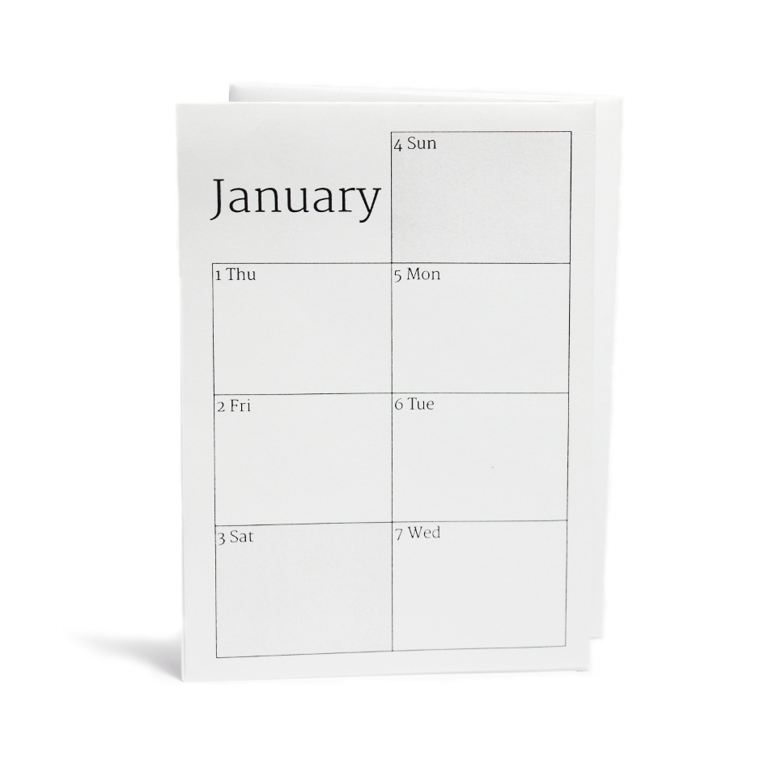

# [Webconfigurator](http://Calendar.MapOfTea.com/)

# papr

Command line tool to generate a PDF template for a small foldable paper calendar.

## Info

Papr currently only produces a PDF output. When you are printing the PDF file make sure you have to automated positioning or resizing features of your printer enabled!

## Quick start

	Usage: papr.py [options]

	Options:
		-h, --help            show this help message and exit
		-A, --abbreviate_all  use abbreviations for weekdays and months
		-a, --abbreviate      use abbreviations for weekdays
		-b BRAND, --brand=BRAND
		                      assign a brand string
		-d, --debug           print status and debug messages to stdout
		-f FONT, --font=FONT  choose which font to use
		-l LOCALE, --locale=LOCALE
		                      choose locale to use (default en_US.UTF8, check
		                      'locale -a' for available locales)
		-m MONTH, --month=MONTH
		                      specify the starting month as a number (1-12), default
		                      is the current month (11).
		-o OUT, --out=OUT     specify output file
		-v, --verbose         print status messages to stdout
		-y YEAR, --year=YEAR  specify the year the calendar should start, default is
		                      the current year (2014).

