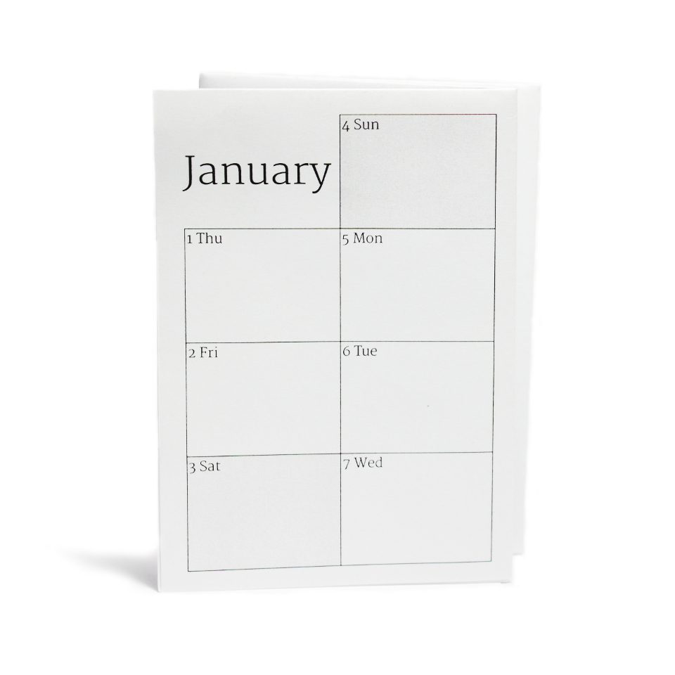
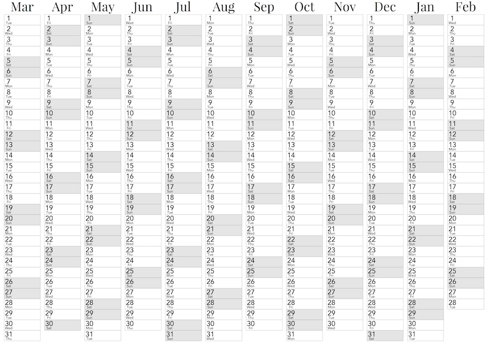

[](https://codecov.io/gh/peetzweg/papr)

# `papr` - Generate Calendar Stationeries

Command line tool to generate empty calendar templates to print. Outputs PDF and SVG.

**[Full documentation](https://peetzweg.github.io/papr/)**



## Quick Start

```sh
papr month -o calendar.pdf -y 2026 -p A4
papr month -o calendar.svg -y 2026 -p A4
papr big -o year.pdf -y 2026 -f 'Avenir Next' -p A3
```

## Installation

### Homebrew (macOS)

```sh
brew tap peetzweg/tap
brew install papr
```

### Cargo (from source)

Requires system libraries: Cairo and Pango.

```sh
# macOS
brew install pango cairo

# Debian/Ubuntu
apt install libpango1.0-dev libcairo2-dev

# Then install papr
cargo install --git https://github.com/peetzweg/papr
```

### From source (manual)

```sh
git clone https://github.com/peetzweg/papr.git
cd papr
cargo build --release
# Binary at ./target/release/papr
```

## Usage

Each layout is a **subcommand** with shared options and optional layout-specific flags:

```
papr <COMMAND> [OPTIONS]

Commands:
  month    Single month portrait calendar
  big      Full year landscape, days flow in rows
  classic  Two months landscape, columnar layout
  column   Four months landscape, vertical columns
  oneyear  Full year on one landscape sheet
  batch    Generate calendars from a YAML batch config
```

### Shared Options (all layout commands)

| Flag | Description | Default |
|------|-------------|---------|
| `-o, --output <FILE>` | Output file (`.pdf` or `.svg`, detected from extension) | `out.pdf` |
| `-y, --year <YEAR>` | Calendar year | current year |
| `-m, --month <MONTH>` | Starting month (1-12) | current month |
| `-p, --paper <SIZE>` | Paper size | `A4` |
| `-f, --font <FONT>` | Font family (pass twice for heading + body font) | `Sans` |
| `-l, --locale <LOCALE>` | Locale for date formatting | `en_US` |
| `--margin <MM>` | Page margin in millimeters | `5` |

**Paper sizes:** A5, A4, A3, A2, A1, A0, USLetter, USTabloid, USLedger

### Layout-Specific Options

**`classic` and `column`:**

| Flag | Description |
|------|-------------|
| `-a` | Abbreviate weekday names |
| `-A` | Abbreviate both weekday and month names |

**`classic` only:**

| Flag | Description |
|------|-------------|
| `-b, --brand <TEXT>` | Brand string printed on the calendar |
| `-c, --color` | Color date numbers |

### Examples

```sh
# Portrait month calendar
papr month -o april.pdf -y 2026 -m 4 -p A4

# Full year with custom font on A3
papr big -o 2026.pdf -y 2026 -f 'Avenir Next' -p A3

# Classic layout with abbreviated weekdays and branding
papr classic -o classic.pdf -y 2026 -a -b "My Calendar" -c

# Four-month column layout, starting June
papr column -o summer.pdf -y 2026 -m 6

# One-year overview with separate heading font
papr oneyear -o overview.svg -y 2026 -f Sans -f 'Georgia'

# SVG output (detected from file extension)
papr month -o calendar.svg
```

## Layouts

See the [full layout documentation](https://peetzweg.github.io/papr/layouts) for visual examples and detailed descriptions.

| Layout | Orientation | Description |
|--------|-------------|-------------|
| [`month`](https://peetzweg.github.io/papr/layouts/month) | Portrait | Single month with header and 7-column grid |
| [`big`](https://peetzweg.github.io/papr/layouts/big) | Landscape | Full year, days in rows of 21 columns with flag labels |
| [`classic`](https://peetzweg.github.io/papr/layouts/classic) | Landscape | Two months, designed for back-to-back printing |
| [`column`](https://peetzweg.github.io/papr/layouts/column) | Landscape | Four months in vertical columns with fold margin |
| [`oneyear`](https://peetzweg.github.io/papr/layouts/oneyear) | Landscape | Full year as 12 mini-columns |



## Batch Mode

Generate many calendars at once from a YAML config file. See the [batch mode documentation](https://peetzweg.github.io/papr/batch-mode) for the full schema and examples.

```sh
papr batch config.yaml
```

```yaml
defaults:
  year: 2026
  font: "Avenir Next"

matrix:
  layout: [month, big, classic, oneyear]
  paper: [A4, A3]
  month: [1, 6]

exclude:
  - layout: big
    paper: A3
    month: 6

output: "calendars/{layout}_{year}_{month}_{paper}.pdf"
```
